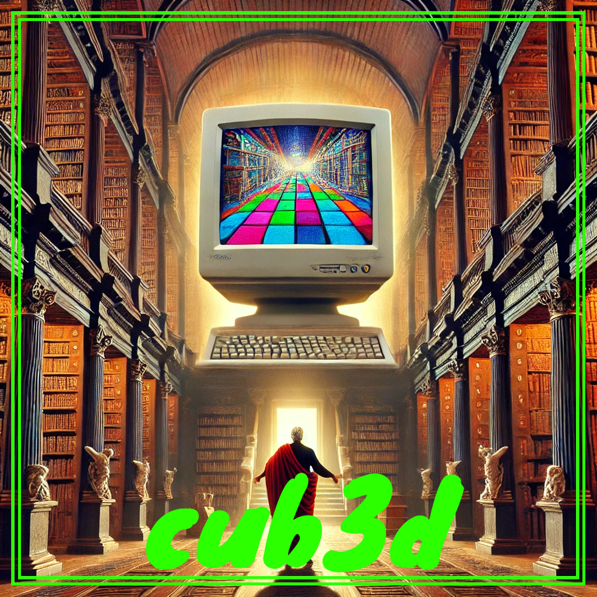

  

## 🚀 SYNOPSIS

The `cub3D` project at 42 school plunges students into the captivating realm of raycasting and 3D graphics rendering within the C language. This immersive endeavor challenges students to develop a rudimentary 3D game engine capable of rendering a textured maze in a two-dimensional plane.

Drawing inspiration from the iconic game Wolfenstein 3D, `cub3D` involves implementing raycasting techniques to simulate the rendering of three-dimensional environments in real-time. Students delve into the intricacies of vector mathematics, spatial geometry, and rendering algorithms to construct a visually compelling game world.

Beyond graphics rendering, the project delves into file parsing, user input handling, and interactive gameplay mechanics.

`cub3D` serves as a springboard for exploring the fusion of computer graphics and game development, empowering students to craft immersive experiences that push the boundaries of visual storytelling and interactive entertainment.

## 🛠️ PROGRAM SPECIFICITIES AND CONSIDERATIONS

Unfinished project, soon.

## ⚙️ USAGE

Unfinished project, soon.

## 🤝 CONTRIBUTION
Contributions are open, open a Github Issue or submit a PR 🚀
